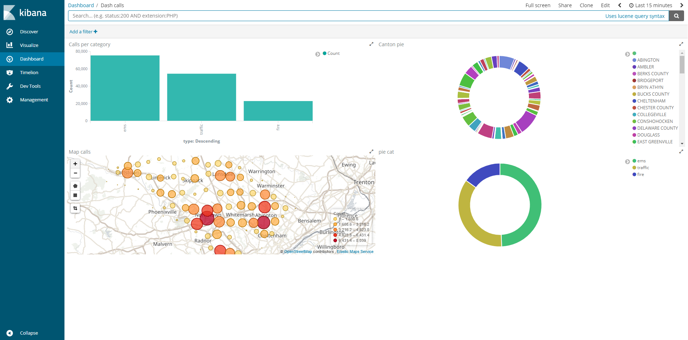

# 911 Calls avec ElasticSearch

## Création de l'index, l'analyser et du mapping
Sous kibana entrer la commande suivante :

```
PUT /911-calls
{ 
  "settings": {
    "analysis": {
      "analyzer": {
        "mine": {
          "type": "custom",
          "tokenizer": "standard"
        }
      }
    }
  },
  "mappings": {
    "calls": {
      "properties": {
        "location": {
          "type": "geo_point"
        },
        "title":{
          "type": "text",
          "analyzer": "mine",
          "fielddata": true
        },
        "type": {
          "type": "text",
          "fielddata": true
        }
      }
    }
  }
}
```

## Import du jeu de données

Pour importer le jeu de données, complétez le script `import.js` (ici aussi, cherchez le `TODO` dans le code :wink:).

Exécutez-le ensuite :

```bash
npm install
node import.js
```

Nous avons choisi de splitter le type de chaque call en amont de l'import et de rajouter une colone 'type' qui inclut les termes suivants {EMS, Fire, Traffic}. Nous aovns fait ceci afin de pouvoir effectuer une requete aggregation plus facilement. Nous avons déséspérément tenté plusieurs type de requête qui cherchait le premier terme de l'attribut title du call, avec des requêtes de type prefix, wildcard et prefix_match_phrase sans résultats. Il y avait toujours le bon nombre de Traffic mais moins de Fire et plus d'EMS.

Pour la date nous avons effectué le même traitement à savoir créer un champ 'month' avec la date au format mm/yyyy. De même nous avons tenté plusieurs requête à savoir mettre un mapping de type date sur le champ 'timeStamp' et ainsi d'effectuer un script_field pour remettre au bon format. Sans résultats.

Toutes les requêtes sont au format Lucene à exécuter dans Kibana pour simplifier.

Vérifiez que les données ont été importées correctement grâce au shell (le nombre total de documents doit être `153194`) :

```
GET 911-calls/calls/_count
```

## Requêtes

### Compter le nombre d'appels autour de Lansdale dans un rayon de 500 mètres
```
GET /911-calls/calls/_search
{
  "query": {
    "bool": {
      "must": {
        "match_all": {}
      },
      "filter": {
        "geo_distance": {
          "distance": "500m",
          "location": {
            "lat": 40.241493,
            "lon": -75.283783
          }
        }
      }
    }
  }
}
```

### Compter le nombre d'appels par catégorie
```
GET /911-calls/calls/_search
{
  "size": 0, 
  "aggs": {
    "group_by_type": {
      "terms": {
        "field": "type",
        "size": 3
      }
    }
  }
}
```

### Trouver les 3 mois ayant comptabilisés le plus d'appels
```
GET /911-calls/calls/_search
{
  "size": 0, 
  "aggs": {
    "group_by_date": {
      "terms": {
        "field": "month.keyword",
        "size": 3
      }
    }
  }
}
```

### Trouver le top 3 des villes avec le plus d'appels pour overdose
```
GET /911-calls/calls/_search
{
  "size": 0,
  "query": {
    "match": {
      "title": "OVERDOSE"
    }
  }, 
  "aggs": {
    "group_by_city": {
      "terms": {
        "field": "twp.keyword",
        "size": 3
      }
    }
  }
}
```

## Kibana

Dans Kibana, créez un dashboard qui permet de visualiser :

* Une carte de l'ensemble des appels
* Un histogramme des appels répartis par catégories
* Un Pie chart réparti par bimestre, par catégories et par canton (township)

Pour nous permettre d'évaluer votre travail, ajoutez une capture d'écran du dashboard dans ce répertoire [images](images).



Nous n'avons pas réussi à mettre un piechart par bimestre puisqu'on a pas réussi au début à importer nos date au format date et non en texte, c'est dû au mapping.

### Timelion
Timelion est un outil de visualisation des timeseries accessible via Kibana à l'aide du bouton : 

Réalisez le diagramme suivant :


Envoyer la réponse sous la forme de la requête Timelion ci-dessous:

Pas de date, pas de requête. Impossible là ici d'avoir une quelconque visualisation. Et on pense que c'est pareil quee ci-dessus, lié aux dates.

```
TODO : ajouter la requête Timelion ici
```
